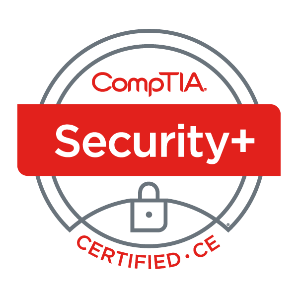

# Hi there, I'm Sam 👋

- 🔭 I’m ~~currently~~ always working on various scripts to improve my workflows.
- 🌱 I’m currently learning Detection Engineering.
- 🎓 I’m currently studying at WGU for the [BSCSIA](https://www.wgu.edu/online-it-degrees/cybersecurity-information-assurance-bachelors-program.html) degree. 
- 🤔 I’m looking for help with building professional connections in the security community.
- 💬 Ask me about the latest Cybersecurity Training & Conference I've attended.
- 📫 How to reach me: [LinkedIn](https://www.linkedin.com/in/sseyller/)
- 😄 Pronouns: he/him
- ⚡ Fun fact: I earned the Practical Junior Penetration Tester (PJPT) cert and enjoyed the challenge more than expected.
- 🎯 2025 Goals: TCM Security - Practical SOC Analyst Professional (PSAP) Certification 

## Languages

While I wouldn’t call myself a developer just yet, I use coding to support my cybersecurity learning and projects. These are the languages I’ve worked with, ranked by comfort level:

- PowerShell
- Python
- SQL
- PHP
- HTML/CSS/JavaScript
- C++
- Java
- Rust

Here are the top languages used on GitHub. I look forward to sharing more as I publish more projects! 

 

## IT Certifications

