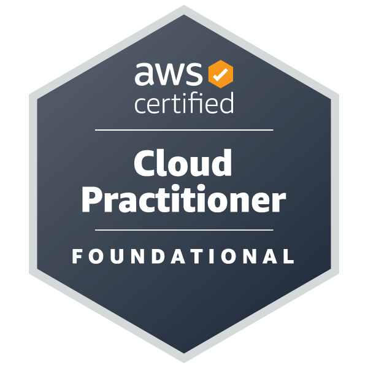

# Hi there, I'm Sam 👋

I'm a Python enthusiast who's excited about learning programming and publishing projects on GitHub. While I'm relatively new to the platform, I have solid experience working with various languages, including C++, Java, PHP, HTML, and JavaScript. As an IT System Administrator with a passion for cybersecurity, I understand the importance and usefulness of programming in the IT profession. While I don't plan on becoming a full-time programmer, I recognize its value and want to continue building my foundational knowledge. Looking forward to collaborating and contributing to the GitHub community!

## My Stats

 |  

## My Top Repos

## IT Certifications

<!--
**samseyller/samseyller** is a ✨ _special_ ✨ repository because its `README.md` (this file) appears on your GitHub profile.

Here are some ideas to get you started:

- 🔭 I’m currently working on ...
- 🌱 I’m currently learning ...
- 👯 I’m looking to collaborate on ...
- 🤔 I’m looking for help with ...
- 💬 Ask me about ...
- 📫 How to reach me: ...
- 😄 Pronouns: ...
- ⚡ Fun fact: ...
-->
